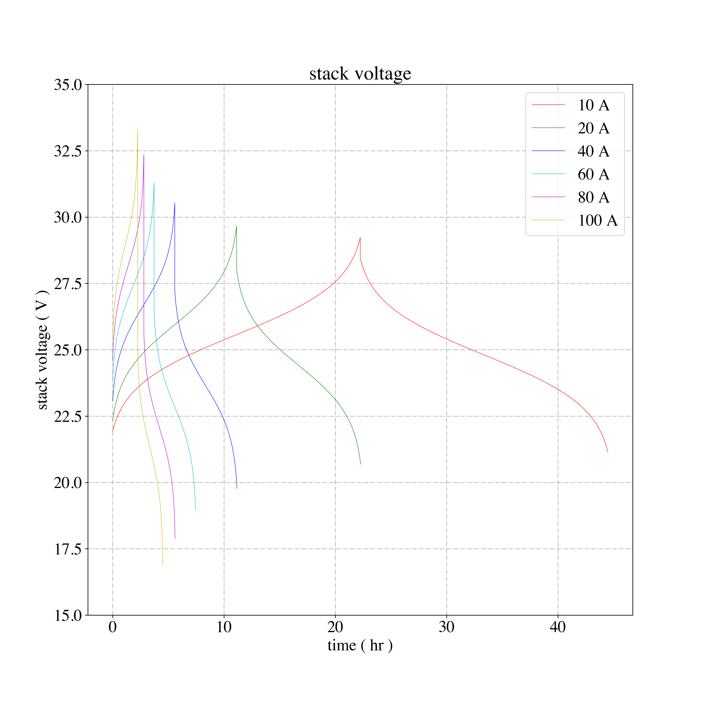

# Vanadium Redox Flow Battery Stack Model

This is the implementation of Christian Blanc and co-workers's electrochemical Stack model from [sp] ["Understanding the Vanadium Redox Flow Batteries"](https://cdn.intechopen.com/pdfs/12523/InTech-Understanding_the_vanadium_redox_flow_batteries.pdf) with Python. Figure and table numbers are with respect to that Blanc and co-workers's document. The notebook recreates:
  * figure 3a (nernst potential as a function of state of charge) 
  * figure 8a (stack voltage as a function of current) power as a function of
    current
  * table 4

**Example Figure 8a**:

